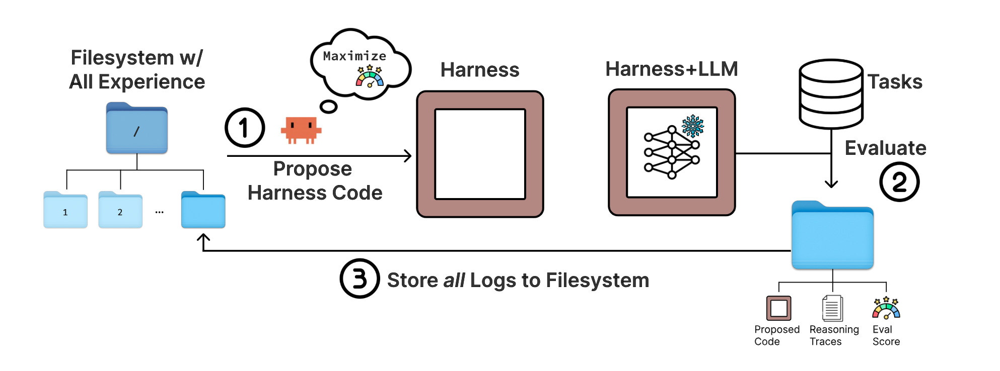

# harness-traj-weaver

<p align="center">
  <strong><a href="https://yoonholee.com/meta-harness/">Meta-Harness</a> 的 Skill 化工程实现</strong>
</p>

<p align="center">
  <a href="./LICENSE"></a>
  <a href="./README.md">English README</a>
</p>

---

## 概述

`harness-traj-weaver` 是一个 Claude Code skill，实现了 Meta-Harness 范式。与传统方法不同，它不依赖固定脚手架、不维护发现存档、不使用持久化记忆机制，而是赋予 proposer 无限制的文件系统访问权限来利用先前的经验——支持对原始代码和执行轨迹进行选择性诊断。

### 为什么选择 Meta-Harness？

传统的 harness 优化依赖于聚合分数和压缩摘要。Meta-Harness 走了一条完全不同的路：

- **文件系统即记忆** — 完整历史直接暴露在磁盘上，而非压缩到向量数据库中
- **轨迹级推理** — 对失败的样本及其执行轨迹进行推理，而非仅仅分析指标
- **搜索集反馈** — proposer 永远看不到测试集结果，所有改进信号均来自搜索集
- **自我进化** — harness 的质量随着底层编码 agent 能力的提升而自动提高

---

## 核心理念

> Its outer loop is deliberately minimal: instead of relying on a fixed scaffold, an archive of prior discoveries, or a persistent memory mechanism, it gives the proposer unrestricted filesystem access to prior experience.

> Rather than reacting only to aggregate scores or summaries, the proposer in Meta-Harness can reason over failed examples and their execution traces to propose targeted edits.

> Meta-Harness can improve automatically as coding agents become more capable. The proposer never sees test-set results; its only feedback comes from the search set, the subset of task instances used to evaluate candidate harnesses during search and generate the feedback signal for improvement.

> Its key design choice is to expose full history through a filesystem, enabling selective diagnosis of raw prior code and execution traces rather than optimization from compressed per-candidate summaries.

---

## 架构

<p align="center">
  
</p>

外循环刻意保持极简——不依赖固定脚手架、不维护发现存档、不使用持久化记忆机制。proposer 通过无限制的文件系统访问来利用先前的经验，直接对失败样本及其执行轨迹进行推理，从而提出精准的定向修复。

---

## 演示

<p align="center">
  <video src="docs/tutorial.mp4" controls muted width="700" poster="docs/metaharness.png"></video>
</p>

---

## 评估

基准评估结果将在此发布。

| 基准测试 | 分数 | 日期 |
|----------|------|------|
| 待定 | — | — |

---

## 快速开始

### 前置要求

- 已安装 [Claude Code](https://claude.ai/code)

### 安装

```bash
git clone https://github.com/yangjing/harness-traj-weaver.git ~/.claude/skills/harness-traj-weaver
```

---

## 参与贡献

欢迎提交 issue 和 pull request。

---

## 许可证

MIT

---

## 另见

- [English README](./README.md)
- [Meta-Harness](https://yoonholee.com/meta-harness/)
- [QUICKSTART](./QUICKSTART.md)
- [CHANGELOG](./CHANGELOG.md)
