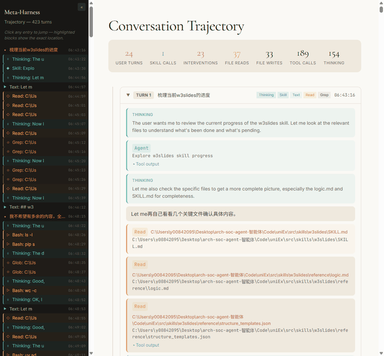
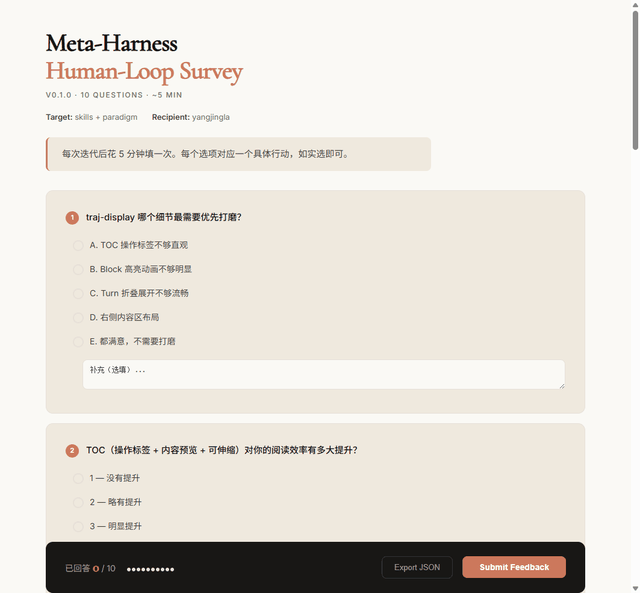

# harness-traj-weaver

<p align="center">
  <strong><a href="https://yoonholee.com/meta-harness/">Meta-Harness</a> 的 Skill 化工程实现</strong>
</p>

<p align="center">
  <a href="./LICENSE"></a>
  <a href="./readme.md">English README</a>
</p>

---

## 安装

```bash
git clone https://github.com/yangjing/harness-traj-weaver.git ~/.claude/skills/harness-traj-weaver
```

安装后，skill 会在下次启动时自动加载，无需额外配置。

## 使用

```bash
cd ~/.claude/skills/harness-traj-weaver

# 从 Claude Code 会话生成轨迹
python skills/traj/scripts/generate_traj.py \
  --input ~/.claude/projects/<project>/<session>.jsonl \
  --output traj.html

# 终端交互式 QA（主要反馈路径）
python skills/survey/scripts/probe-diff.py          # 状态探测，驱动 diff-aware 问题
python skills/survey/scripts/archive-auq-answers.py  # 归档 QA 答案到 .metaharness/

# 生成 HTML 问卷（异步备用）
python skills/survey/scripts/generate_survey.py \
  --type qa \
  --output survey.html

# 开发服务器（POST 提交反馈）
python skills/survey/scripts/archive_feedback.py 8767
```

---

## 演示

<video src="docs/tutorial.mp4" controls muted width="100%">
  你的浏览器不支持嵌入式视频。<a href="docs/tutorial.mp4">下载 MP4</a>
</video>

| 轨迹展示 | 反馈问卷 |
|---|---|
|  |  |
---

## 概述

`harness-traj-weaver` 是一个 Claude Code skill，实现了 Meta-Harness 范式——赋予 proposer 无限制的文件系统访问权限来利用先前的经验，对原始代码和执行轨迹进行选择性诊断。

- **文件系统即记忆** — 完整历史在磁盘上，无需向量数据库
- **轨迹级推理** — 从原始 trace 诊断，而非压缩摘要
- **搜索集反馈** — 永远不暴露测试集结果
- **自我进化** — harness 随 coding agent 能力提升而自动改进

---

## Skills

| Skill | 描述 |
|---|---|
| **traj** | Claude Code 会话轨迹可视化 — TOC 导航、Turn 折叠、颜色编码 Block、Skill 使用高亮 |
| **survey** | Human-loop QA — 终端交互式问答（27 题、7 节），通过 Claude 的 AskUserQuestion 工具驱动，HTML 表单作为异步备用 |
| **metric** | 评估指标仪表板模板 |

---

## 评估 — v0.3.0

```
.metaharness/v0.3.0/
  inputs/
    qa-survey-*.json        ← 27 题完整 QA 答案（human-loop 终端交互式）
  outputs/
    traj-378bb48b.html      ← 发布 session 轨迹 (12 turns, 906 records)
  plan-v0.4.0.json          ← 基于 QA 反馈的下版本计划
```

---

## 参与贡献

欢迎提交 issue 和 pull request。

---

## 许可证

MIT

---

## 另见

- [English README](./readme.md)
- [Meta-Harness](https://yoonholee.com/meta-harness/)
- [QUICKSTART](./quickstart.md)
- [CHANGELOG](./changelog.md)
